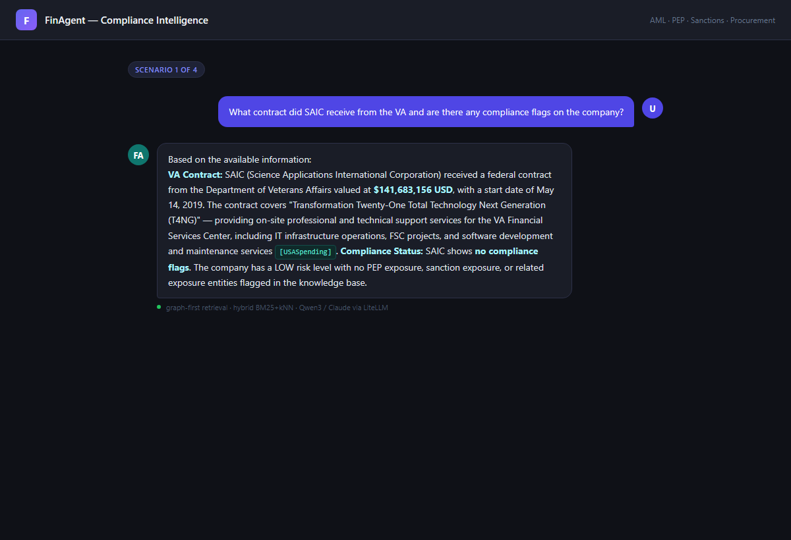
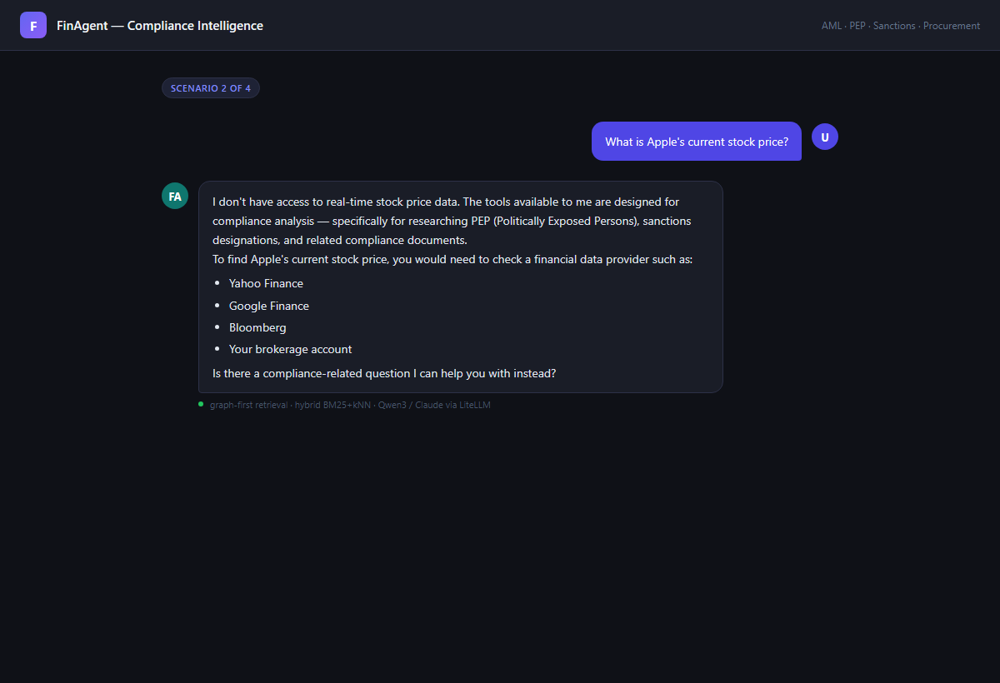
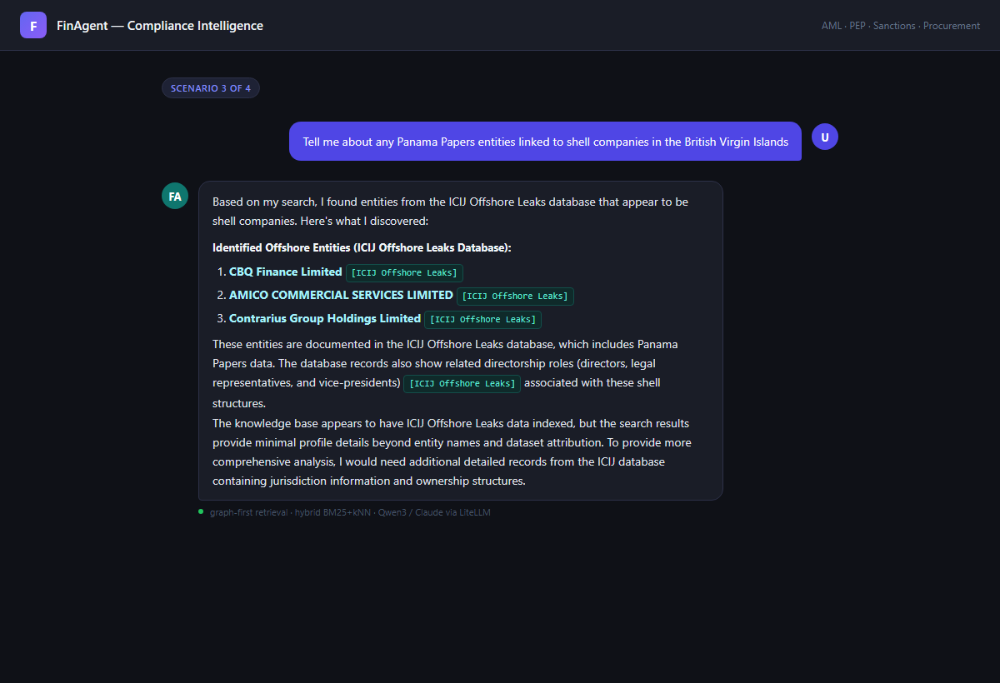
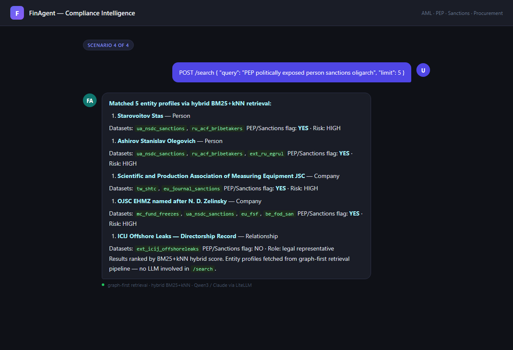
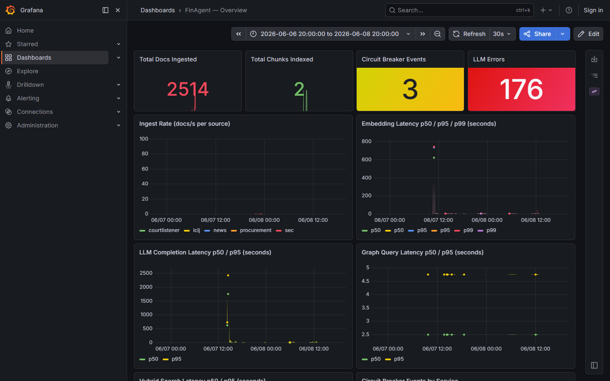
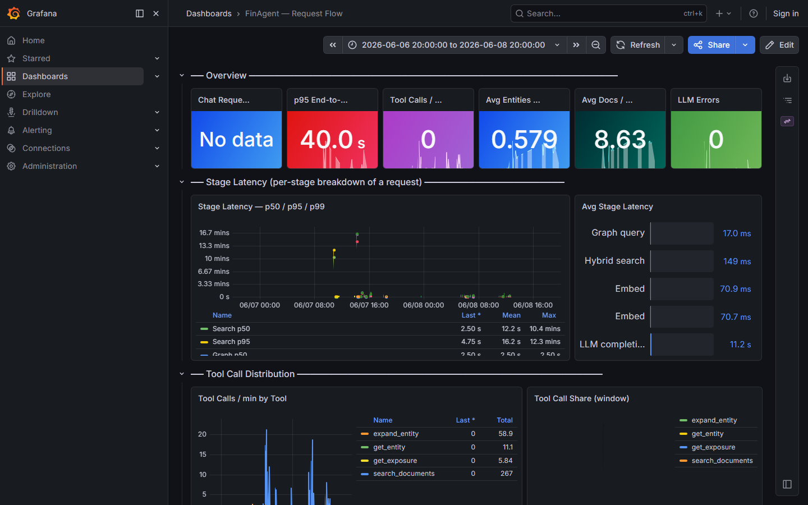
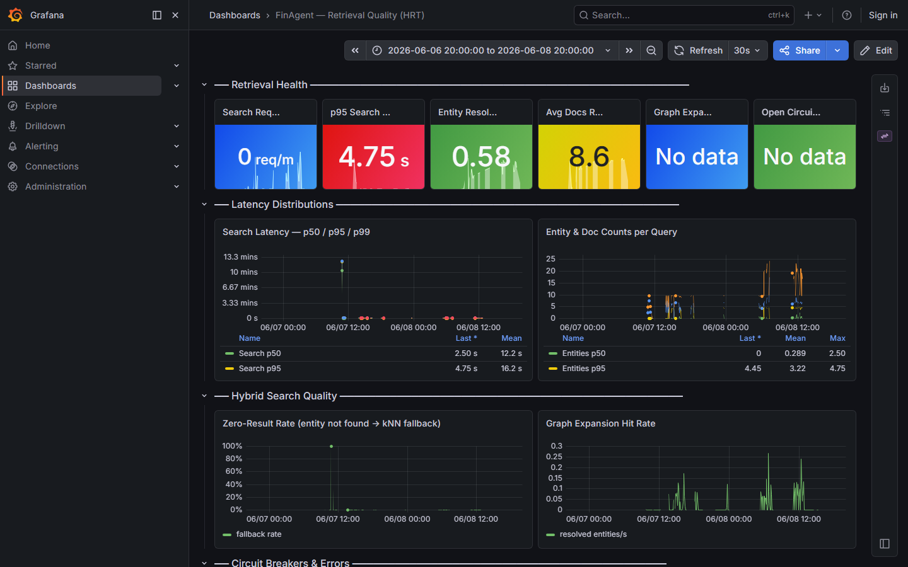
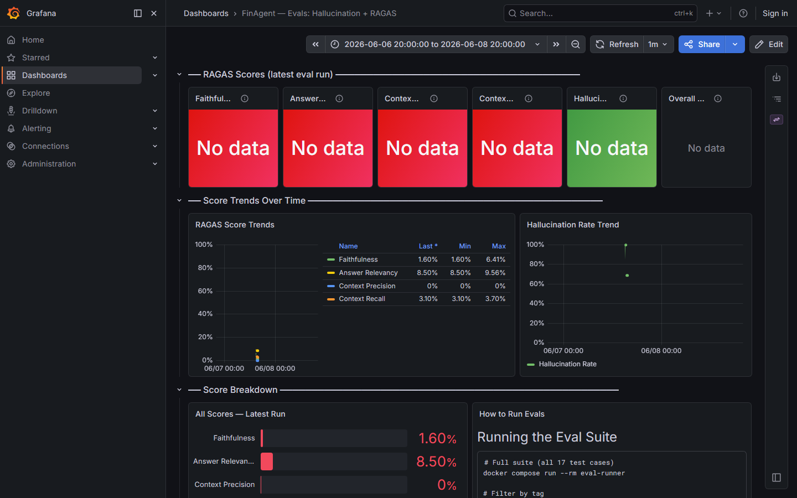
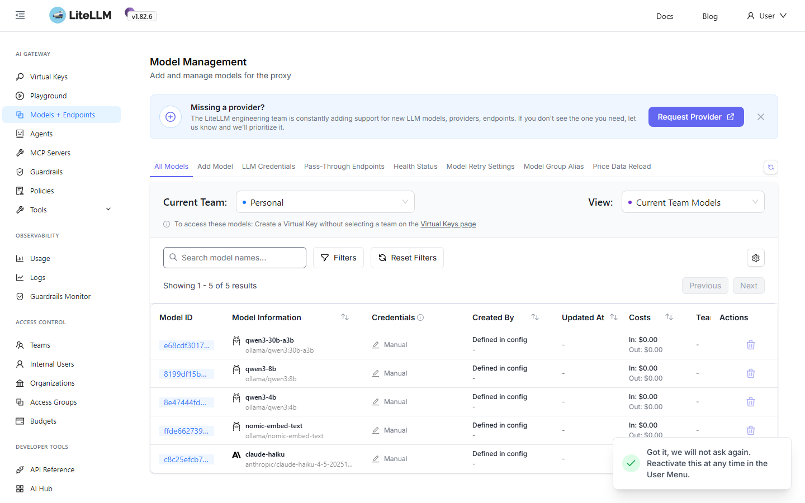
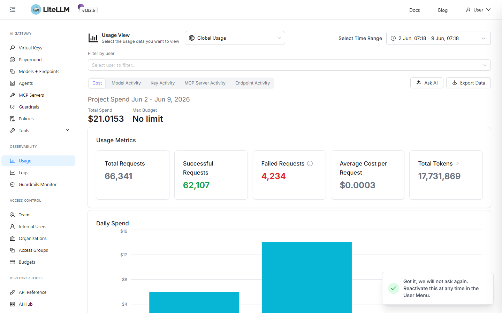

# FinAgent — Compliance Intelligence Platform

AML / PEP / sanctions investigation platform combining a knowledge graph (FalkorDB), hybrid vector search (OpenSearch BM25+kNN), and an LLM agent into a single chat-driven research tool with full OTel observability.

---

## What It Does

- **Entity graph** — OpenSanctions + KYB data in FalkorDB; multi-hop Cypher traversal finds ownership chains and PEP connections invisible to vector search alone
- **Hybrid retrieval** — graph-first (entity extraction → 2-hop expansion → BM25+kNN), not vector-first; prevents missing related entities
- **LLM agent** — PydanticAI agent with 4 tools (`search_documents`, `get_entity`, `get_exposure`, `expand_entity`); routes to local Qwen3-4B via Ollama or Claude via one env var
- **Rate limiting** — 10 req/min on `/chat`, 60 req/min on `/search` per IP via slowapi
- **Observability** — full OTel (Tempo + Prometheus + Loki) via `grafana/otel-lgtm`; 4 pre-built dashboards, no login required
- **Evals** — RAGAS faithfulness / relevancy / precision / recall + LLM-as-judge hallucination scoring piped to Grafana

---

## Screenshots

**Procurement cross-reference — SAIC / VA contract**


**Out-of-scope refusal — hallucination guard**


**ICIJ Offshore Leaks — Panama Papers shell companies**


**Direct hybrid search — sanctioned entities (`/search`)**


### Observability — Grafana

**FinAgent — Overview (embedding, LLM & graph latency)**


**FinAgent — Request Flow (p95 end-to-end, tool call distribution)**


**FinAgent — Retrieval Quality (search rate, entity resolution, doc counts)**


**FinAgent — Evals: Hallucination + RAGAS score trends**


### LLM Gateway — LiteLLM

**LiteLLM — Model management (Qwen3, nomic-embed-text, Claude Haiku)**


**LiteLLM — Usage (66 k requests · 17.7 M tokens · $21 total spend)**


---

## Quick Start

Full instructions including troubleshooting in **[docs/Setup.md](docs/Setup.md)**.

```bash
# 1. Configure environment
cp .env.example .env
# Required: SEC_USER_AGENT, LITELLM_MASTER_KEY, WEBUI_ADMIN_PASSWORD

# 2. Start infrastructure
docker compose up -d redis-stack opensearch postgres ollama otel-lgtm
docker compose run --rm ollama-init        # pulls qwen3:4b + nomic-embed-text
docker compose up -d litellm

# 3. Load data (one-time — persists in volumes)
docker compose run --rm sanctions-ingestor  # OpenSanctions → FalkorDB  (~20–60 min)
docker compose run --rm doc-ingestor        # 5 sources → OpenSearch    (~20–40 min)

# 4. Start API and UI
docker compose up -d api open-webui opensearch-dashboards
```

---

## Tech Stack

| Layer | Technology | Role |
| --- | --- | --- |
| Agent framework | PydanticAI 0.4.2 | Tool-calling agent — no LangChain |
| API | FastAPI + slowapi | Three routers + per-IP rate limits |
| LLM gateway | LiteLLM | Routes to Ollama or Claude; one-line model swap |
| Chat model | Qwen3-4B (Ollama) | Default local model, Apache 2.0, ~3 GB |
| Embedding model | nomic-embed-text | Local 768-dim, no API key required |
| Graph DB | FalkorDB | Entity graph, PEP / sanctions paths (RedisGraph fork) |
| Vector DB | OpenSearch 2.13 | BM25+kNN hybrid index |
| Entity extraction | spaCy + GLiNER | Hybrid NER; GLiNER preferred for financial entities |
| Entity resolution | RapidFuzz | Fuzzy match extracted mentions → graph canonical IDs |
| Observability | grafana/otel-lgtm | Traces, metrics, logs; 4 pre-provisioned dashboards |
| Evals | RAGAS + LLM-as-judge | Faithfulness / hallucination rate, exported to Grafana |

---

## API

| Endpoint | Rate Limit | Purpose |
| --- | --- | --- |
| `POST /chat` | 10 / min / IP | Full agent — graph + vector + LLM |
| `POST /search` | 60 / min / IP | Direct hybrid retrieval, no LLM |
| `GET /entity/{id}` | — | Raw entity node profile from FalkorDB |
| `GET /entity/{id}/exposure` | — | PEP / sanctions risk chain + risk level |

Swagger UI: <http://localhost:8000/docs>

---

## Service URLs

| Service | URL |
| --- | --- |
| FinAgent API | <http://localhost:8000> |
| Chat UI (Open WebUI) | <http://localhost:3001> |
| Grafana | <http://localhost:3100> |
| FalkorDB Browser | <http://localhost:3000> |
| OpenSearch Dashboards | <http://localhost:5601> |
| LiteLLM Proxy | <http://localhost:4000> |

Full reference including credentials and Grafana dashboard URLs: **[docs/Links.md](docs/Links.md)**

---

## Documentation

| Document | Contents |
| --- | --- |
| [docs/Setup.md](docs/Setup.md) | Step-by-step setup, data ingestion, curl examples, troubleshooting |
| [docs/Architecture.md](docs/Architecture.md) | System design, services, data stores, observability, design decisions |
| [docs/AgentWorkflowExplaination.md](docs/AgentWorkflowExplaination.md) | Service & agent flow diagram, tool reference table |
| [docs/IngestionFlow.md](docs/IngestionFlow.md) | Ingestion pipeline + 4 alternative architectures with trade-off comparison |
| [docs/Demo.md](docs/Demo.md) | 3 live demo scenarios with trace IDs, sequence diagrams, expected outputs |
| [docs/Links.md](docs/Links.md) | All local URLs, API endpoints, Grafana dashboards, external data sources |

---

## Directory Structure

```text
FinAgent/
├── apps/
│   ├── api/
│   │   ├── main.py             FastAPI app factory
│   │   ├── limiter.py          slowapi Limiter singleton
│   │   ├── dependencies.py     lru_cache service factories
│   │   └── routers/            chat.py · search.py · entity.py
│   └── worker/
│       ├── ingestion_worker.py Parallel fetch → pipeline → profile builder
│       └── profile_builder.py  Synthetic entity / exposure profile documents
├── core/
│   ├── config.py               Pydantic-settings — all config from env
│   └── models.py               Shared Pydantic models
├── graph/
│   ├── entity_resolver.py      spaCy NER → exact / fuzzy graph lookup
│   ├── redis_graph_repository.py  FalkorDB Cypher queries
│   └── exposure_service.py     PEP + sanctions paths → risk level
├── vector/
│   ├── embeddings.py           embed() via LiteLLM proxy
│   ├── opensearch_repository.py   BM25+kNN hybrid search
│   ├── retriever.py            RetrievalService with OTel spans
│   └── index_setup.py          kNN + BM25 field mappings
├── llm/
│   ├── agent.py                PydanticAI agent + 4 tools + loop guard
│   └── litellm_client.py       OpenAI-compatible LiteLLM client
├── ingestion/
│   ├── pipeline.py             Chunk → enrich → embed → checkpoint → index
│   ├── chunking.py             Sentence-boundary split, 1 200 chars / 200 overlap
│   ├── entity_extraction.py    spaCy + GLiNER hybrid NER
│   ├── enrichment.py           Entity linking + char-span annotation
│   └── sources/                sec · courtlistener · icij · procurement · news
├── ingestion-pipelines/
│   └── sanctions-pipeline/     OpenSanctions JSONL → FalkorDB (standalone one-shot)
├── observability/
│   ├── setup.py                OTel SDK init
│   ├── metrics.py              Histograms + counters
│   ├── circuit_breakers.py     Per-service aiobreaker circuit breakers
│   └── tracing.py              get_tracer() helper
├── eval/
│   └── runner.py               RAGAS + LLM-judge; reads FINAGENT_API_BASE
├── resources/
│   ├── litellm-config.yaml     Model routing config
│   └── grafana/dashboards/     4 pre-provisioned dashboard JSON files
└── docs/                       All documentation (see table above)
```
