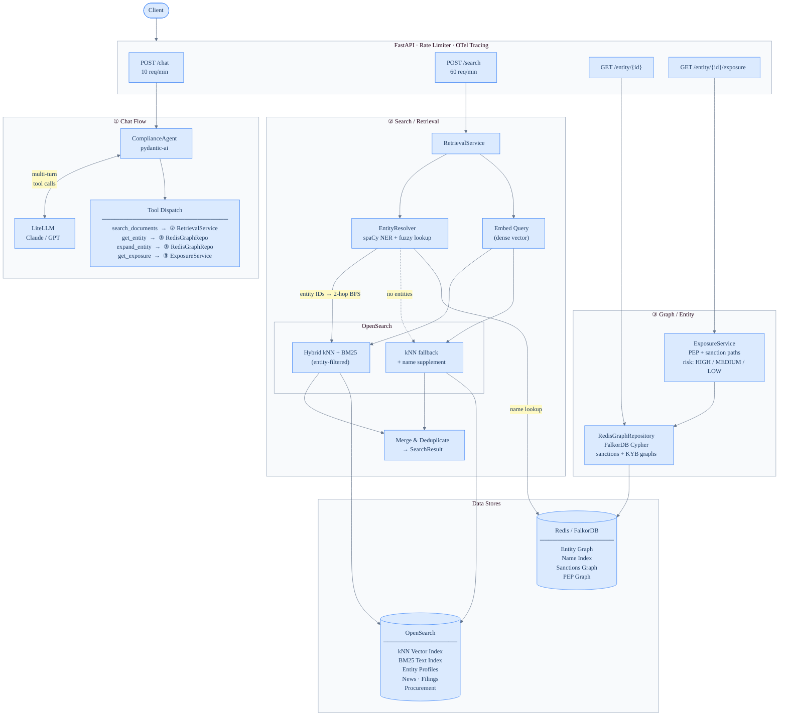

# FinAgent — Service & Agent Workflow

**Navigation:** [README](../README.md) · [Architecture](Architecture.md) · [Ingestion Architectures](IngestionFlow.md) · [Links](Links.md) · [Demo](Demo.md)

---

> **Rendering note**
>
> - **GitHub**: renders Mermaid natively — no setup needed.
> - **VSCode**: install [`bierner.markdown-mermaid`](https://marketplace.visualstudio.com/items?itemName=bierner.markdown-mermaid) and open preview with `Ctrl+Shift+V`.
> - **PNG export**: `docs/workflow_td.png` — regenerate with `mmdc -i docs/workflow_td.mmd -o docs/workflow_td.png -s 3`.

---

## Service Flow

> **Tool Dispatch** (inside Chat Flow): the agent's tools call into the other lanes at runtime.
> The `①②③` labels in the Tool Dispatch box show which lane each tool routes to.

### Endpoint Summary

| Endpoint | Rate Limit | Entry Point | Purpose |
| --- | --- | --- | --- |
| `POST /chat` | 10 / min | `ComplianceAgent` | Multi-turn LLM agent with tool use |
| `POST /search` | 60 / min | `RetrievalService` | Direct hybrid vector + graph search |
| `GET /entity/{id}` | — | `RedisGraphRepository` | Raw entity node profile |
| `GET /entity/{id}/exposure` | — | `ExposureService` | Risk classification with PEP / sanction paths |

---

## Agent Tool Reference: `get_entity` vs `get_exposure` vs `expand_entity`

| | `get_entity` | `get_exposure` | `expand_entity` |
| --- | --- | --- | --- |
| **Input** | `entity_id` (known graph ID) | `entity_id` (known graph ID) | `entity_name` (free-text string) |
| **First step** | Direct graph lookup | Direct graph lookup | NER + fuzzy/exact name resolution → resolves `entity_id` first |
| **Graph query** | `MATCH (e {id}) RETURN e LIMIT 1` — single node fetch | 3-hop BFS + PEP paths (depth 4) + sanction paths (depth 4) | 2-hop BFS `MATCH (e)-[*1..2]-(n)` |
| **Returns** | Raw node properties (name, schema, datasets, aliases) | Structured risk report: related entities, PEP paths, sanction paths, `risk_level` | Flat list of neighbouring `Entity` objects (id, name, schema_type) |
| **Risk classification** | None | Yes — `HIGH` if any sanction path, `MEDIUM` if any PEP path, `LOW` otherwise | None |
| **Who calls it** | Agent tool + REST `GET /entity/{id}` | Agent tool + REST `GET /entity/{id}/exposure` | Agent tool only (also used internally by `RetrievalService`) |
| **Typical agent use** | "Who is entity X? What are their known aliases?" | "Is entity X sanctioned or a PEP? What's the risk?" | "What other entities are connected to [name]?" — bridges free-text → graph neighbourhood |
| **Graph hops** | 0 (single node) | 3 BFS + 4 PEP/sanction path traversal | 2 BFS |
| **Fans out across graphs** | Yes (sanctions + KYB) | Yes (sanctions + KYB) | Yes (sanctions + KYB) |

### One-line summary

- **`get_entity`** — *"Give me the raw profile of this node."*
- **`get_exposure`** — *"Is this entity dirty, and how?"* — returns a risk verdict with evidence paths.
- **`expand_entity`** — *"I have a name string — who is it and who are their graph neighbours?"* — name resolution first, then traversal.
