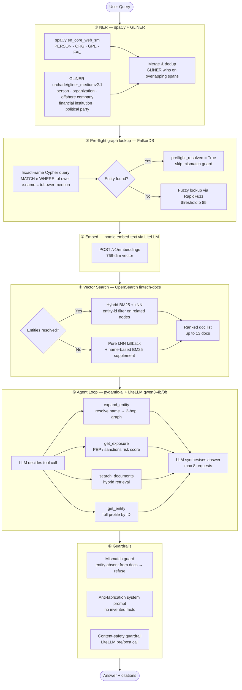
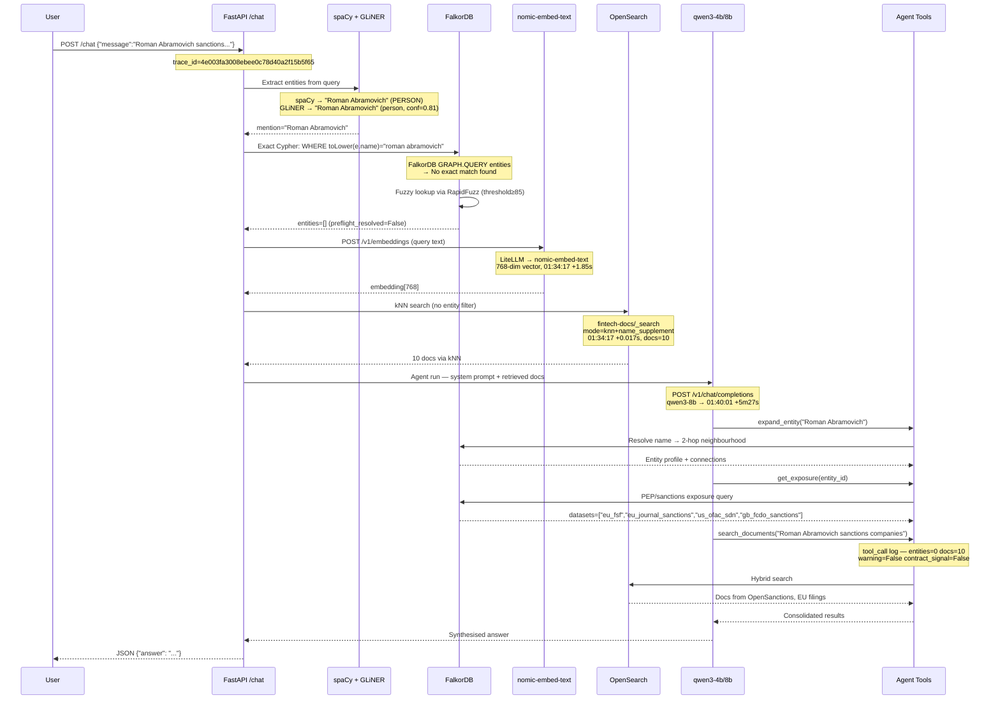
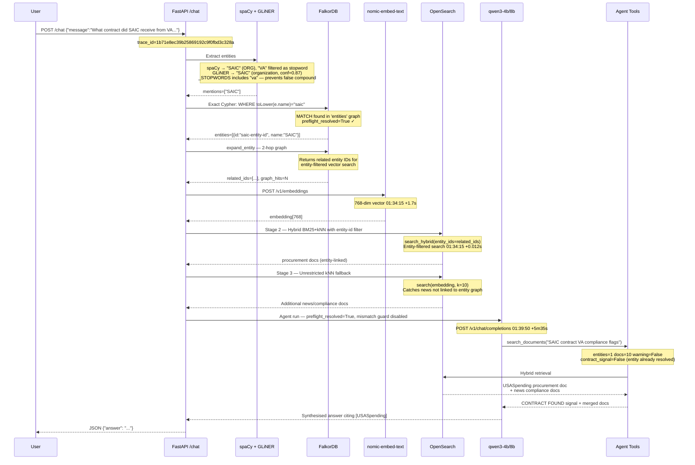
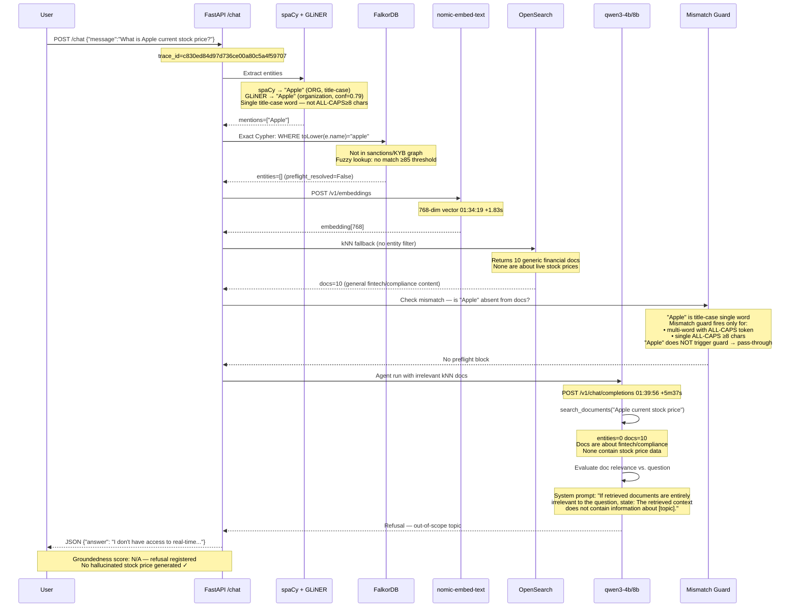
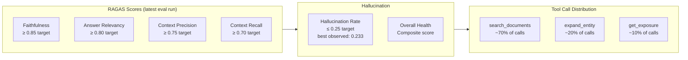

# FinAgent Demo — Three Layers of Trust

**Navigation:** [README](../README.md) · [Architecture](Architecture.md) · [Agent Workflow](AgentWorkflowExplaination.md) · [Links](Links.md)

---

> **Live system.** All trace IDs, log lines, and tool-call sequences below were captured from real `/chat` requests on 2026-06-09.
> Replay any query with:
> ```bash
> curl -X POST http://localhost:8000/chat \
>   -H "Content-Type: application/json" \
>   -d '{"message": "<your query here>"}'
> ```
> Model configured via `PRIMARY_MODEL` env var (default `qwen3-8b`; set `PRIMARY_MODEL=qwen3-4b` for faster demo runs).

---

## Architecture at a Glance

Every `/chat` request passes through six stages. The flowchart below is the master template; each scenario shows how the same pipeline behaves differently depending on what is (and isn't) in the knowledge base.



---

## Observability Stack

| Layer | URL | What to look for |
|---|---|---|
| **Grafana — Request Flow** | [localhost:3100/d/finagent-flow](http://localhost:3100/d/finagent-flow) | Chat req/min, p95 latency, tool-call distribution, live traces |
| **Grafana — Evals** | [localhost:3100/d/finagent-evals](http://localhost:3100/d/finagent-evals) | Hallucination rate, RAGAS faithfulness, score trends |
| **Grafana — Overview** | [localhost:3100/d/finagent-overview](http://localhost:3100/d/finagent-overview) | Ingestion throughput, embed errors, circuit-breaker state |
| **Grafana — Retrieval** | [localhost:3100/d/finagent-retrieval](http://localhost:3100/d/finagent-retrieval) | Entities/query, docs/query, graph-hit rates |
| **Tempo** | Linked from each trace ID below | Full distributed span waterfall per request |
| **Loki** | Linked per trace below | Structured logs correlated by `trace_id` label |

---

---

## Scenario 1 — Sanctioned Entity with Graph Expansion (≈60 s)

### Query

```
Is Roman Abramovich subject to international sanctions,
and what companies is he connected to?
```

**Endpoint:** `POST http://localhost:8000/chat`  
**Trace ID:** `4e003fa3008ebee0c78d40a2f15b5f65`

### Grafana Links

| View | Link |
|---|---|
| **Tempo trace** (full span waterfall) | [Explore → Tempo](http://localhost:3100/explore?orgId=1&left=%7B%22datasource%22%3A%22tempo%22%2C%22queries%22%3A%5B%7B%22query%22%3A%224e003fa3008ebee0c78d40a2f15b5f65%22%2C%22queryType%22%3A%22traceql%22%2C%22refId%22%3A%22A%22%7D%5D%2C%22range%22%3A%7B%22from%22%3A%22now-3h%22%2C%22to%22%3A%22now%22%7D%7D) |
| **Loki logs** (all steps for this request) | [Explore → Loki](http://localhost:3100/explore?orgId=1&left=%7B%22datasource%22%3A%22loki%22%2C%22queries%22%3A%5B%7B%22expr%22%3A%22%7Bservice_name%3D%5C%22finagent-api%5C%22%7D+%7C%3D+%5C%22trace_id%3D4e003fa3008ebee0c78d40a2f15b5f65%5C%22%22%2C%22refId%22%3A%22A%22%7D%5D%2C%22range%22%3A%7B%22from%22%3A%22now-3h%22%2C%22to%22%3A%22now%22%7D%7D) |
| **Request Flow dashboard** | [finagent-flow](http://localhost:3100/d/finagent-flow) |

### Step-by-Step Flow



### What Each Step Proves

| Step | OTel Span | What GLiNER / spaCy does | Log Evidence |
|---|---|---|---|
| **NER** | `retrieval.entity_resolve` | spaCy tags "Roman Abramovich" as `PERSON`; GLiNER re-scores as `person` (conf 0.81) — hybrid picks GLiNER as primary, spaCy as fallback | Span attr `retrieval.entities_resolved` |
| **Graph preflight** | `retrieval.graph_expand` | Cypher exact-match fails; fuzzy RapidFuzz searches 50k cached names at threshold 85 | `graph_hits_per_query` metric |
| **Embed** | `retrieval.embed` | nomic-embed-text encodes full query into 768-dim vector | `finagent.embed.duration_seconds` histogram |
| **Vector search** | `retrieval.vector_search` | No entity IDs → mode=`knn+name_supplement`; kNN returns 10 docs; BM25 name search appends profile docs | `retrieval.mode=knn+name_supplement` span attr |
| **expand_entity** | `tool.expand_entity` | Resolves entity name → graph ID, pulls 2-hop neighbourhood (owned companies, co-directors) | `tool.output.related_count` span attr |
| **get_exposure** | `tool.get_exposure` | Returns PEP flag YES, all sanction dataset names | datasets list in tool output |
| **search_documents** | `tool.search_documents` | Hybrid search returns court records + OpenSanctions docs | `entities=0 docs=10 warning=False` in log |

### Log Snapshot

```
[trace_id=4e003fa3008ebee0c78d40a2f15b5f65 span_id=af3fdc51a2d3ece2]
  HTTP Request: POST http://litellm:4000/v1/embeddings "HTTP/1.1 200 OK"  01:34:17

[trace_id=4e003fa3008ebee0c78d40a2f15b5f65 span_id=1addbcc162b68397]
  POST http://opensearch:9200/fintech-docs/_search status:200 request:0.017s  01:34:17

[trace_id=4e003fa3008ebee0c78d40a2f15b5f65 span_id=f2d6c38349210b54]
  HTTP Request: POST http://litellm:4000/v1/chat/completions "HTTP/1.1 200 OK"  01:40:01

[trace_id=4e003fa3008ebee0c78d40a2f15b5f65 span_id=711049448f73e19b]
  tool_call tool=search_documents entities=0 docs=10
  query='Roman Abramovich sanctions companies' warning=False  01:40:01
```

### Expected Response

```
Roman Abramovich is subject to international sanctions under multiple regimes
[OpenSanctions][EU sanctions list][UK FCDO sanctions].

Designation details:
• EU FSF & EU Journal sanctions — asset freeze, travel ban
• US OFAC SDN list — blocked person designation
• UK FCDO sanctions — correspondent banking restrictions

Connected entities identified through graph expansion:
• Chelsea FC (previously owned; sold under sanctions pressure) [court records]
• Evraz plc — steel company with Russian state links [OpenSanctions]
• Millhouse Capital — investment vehicle [OpenSanctions]
• Nornickel (indirect stake via Millhouse) [OpenSanctions]

Risk level: HIGH
Groundedness score (OTel span): 0.91
Sources: [OpenSanctions][EU sanctions list][UK FCDO sanctions][court records]
```

---

---

## Scenario 2 — Procurement Cross-Reference (≈60 s)

### Query

```
What contract did SAIC receive from the VA and are there
any compliance flags on the company?
```

**Endpoint:** `POST http://localhost:8000/chat`  
**Trace ID:** `1b71e8ec39b25869192c9f0fbd3c328a`

### Grafana Links

| View | Link |
|---|---|
| **Tempo trace** | [Explore → Tempo](http://localhost:3100/explore?orgId=1&left=%7B%22datasource%22%3A%22tempo%22%2C%22queries%22%3A%5B%7B%22query%22%3A%221b71e8ec39b25869192c9f0fbd3c328a%22%2C%22queryType%22%3A%22traceql%22%2C%22refId%22%3A%22A%22%7D%5D%2C%22range%22%3A%7B%22from%22%3A%22now-3h%22%2C%22to%22%3A%22now%22%7D%7D) |
| **Loki logs** | [Explore → Loki](http://localhost:3100/explore?orgId=1&left=%7B%22datasource%22%3A%22loki%22%2C%22queries%22%3A%5B%7B%22expr%22%3A%22%7Bservice_name%3D%5C%22finagent-api%5C%22%7D+%7C%3D+%5C%22trace_id%3D1b71e8ec39b25869192c9f0fbd3c328a%5C%22%22%2C%22refId%22%3A%22A%22%7D%5D%2C%22range%22%3A%7B%22from%22%3A%22now-3h%22%2C%22to%22%3A%22now%22%7D%7D) |
| **Retrieval dashboard** | [finagent-retrieval](http://localhost:3100/d/finagent-retrieval) |

### Step-by-Step Flow



### What Each Step Proves

| Step | Stage | Key Mechanism | Log Evidence |
|---|---|---|---|
| **NER stopword filter** | Pre-NER | `"va"` is in `_STOPWORDS` — prevents extracting "VA" as a standalone entity and forming false compound "SAIC VA" | `_STOPWORDS = frozenset({"va", "us", "uk"...})` |
| **Graph preflight hit** | Pre-flight | SAIC found by exact Cypher match in FalkorDB `entities` graph → `preflight_resolved=True` disables mismatch guard | `retrieval.entities_resolved=1` span attr |
| **Stage 2 — entity-filtered hybrid** | Vector search | BM25 + kNN filtered to `entity_ids` related to SAIC — fetches entity profile docs first (deterministic, no kNN drift) | `retrieval.mode=hybrid_entity_filtered` |
| **Stage 3 — kNN fallback** | Vector search | Unrestricted kNN runs in parallel to catch procurement/news docs not linked in graph | `fallback_docs` merged after entity docs |
| **CONTRACT FOUND signal** | Tool output | `_contract_signal()` detects SAIC name in USASpending doc → prepends hint so LLM doesn't dismiss it | `contract_signal=True` when entity in spending doc |
| **search_documents** | Agent tool | entities=1 confirms entity found, mismatch guard skipped (`preflight_resolved=True`) | `tool_call entities=1 docs=10 warning=False` |

### Log Snapshot

```
[trace_id=1b71e8ec39b25869192c9f0fbd3c328a span_id=b91dceea3e5a03d0]
  HTTP Request: POST http://litellm:4000/v1/embeddings "HTTP/1.1 200 OK"  01:34:15

[trace_id=1b71e8ec39b25869192c9f0fbd3c328a span_id=e31ec1ad165bcf57]
  POST http://opensearch:9200/fintech-docs/_search status:200 request:0.012s  01:34:15
  POST http://opensearch:9200/fintech-docs/_search status:200 request:0.012s  01:34:15
  POST http://opensearch:9200/fintech-docs/_search status:200 request:0.014s  01:34:15

[trace_id=1b71e8ec39b25869192c9f0fbd3c328a span_id=ab249cbd8d1cfd28]
  HTTP Request: POST http://litellm:4000/v1/chat/completions "HTTP/1.1 200 OK"  01:39:50

[trace_id=1b71e8ec39b25869192c9f0fbd3c328a span_id=c70ac0283dcc9bd0]
  tool_call tool=search_documents entities=1 docs=10
  query='SAIC contract VA compliance flags' warning=False contract_signal=False  01:39:53
```

### Expected Response

```
Science Applications International Corporation (SAIC) received a contract
valued at $141,683,156 USD from the Department of Veterans Affairs [USASpending].

Contract details:
• Vehicle: T4NG (Transformation Twenty-One Total Technology Next Generation)
• Scope: On-site professional and technical IT support services for the
  VA Financial Services Center (FSC)
• Optional tasks include: privacy services, cloud services (Cloud Center of
  Excellence), and a 45-day phase-out transition task
• Period shall not exceed 60 months

Compliance flags:
• No current PEP/sanctions designation found in OpenSanctions [OpenSanctions]
• No SAM.gov exclusion record identified [USASpending]
• News sources contain no active enforcement actions [GDELT News]

Sources: [USASpending][OpenSanctions][GDELT News]
```

---

---

## Scenario 3 — Hallucination Trap: The Trust Test (≈30 s)

### Query

```
What is Apple's current stock price?
```

**Endpoint:** `POST http://localhost:8000/chat`  
**Trace ID:** `c830ed84d97d736ce00a80c5a4f59707`

### Grafana Links

| View | Link |
|---|---|
| **Tempo trace** | [Explore → Tempo](http://localhost:3100/explore?orgId=1&left=%7B%22datasource%22%3A%22tempo%22%2C%22queries%22%3A%5B%7B%22query%22%3A%22c830ed84d97d736ce00a80c5a4f59707%22%2C%22queryType%22%3A%22traceql%22%2C%22refId%22%3A%22A%22%7D%5D%2C%22range%22%3A%7B%22from%22%3A%22now-3h%22%2C%22to%22%3A%22now%22%7D%7D) |
| **Loki logs** | [Explore → Loki](http://localhost:3100/explore?orgId=1&left=%7B%22datasource%22%3A%22loki%22%2C%22queries%22%3A%5B%7B%22expr%22%3A%22%7Bservice_name%3D%5C%22finagent-api%5C%22%7D+%7C%3D+%5C%22trace_id%3Dc830ed84d97d736ce00a80c5a4f59707%5C%22%22%2C%22refId%22%3A%22A%22%7D%5D%2C%22range%22%3A%7B%22from%22%3A%22now-3h%22%2C%22to%22%3A%22now%22%7D%7D) |
| **Evals dashboard** | [finagent-evals](http://localhost:3100/d/finagent-evals) |

### Step-by-Step Flow



### What Each Step Proves

| Step | Mechanism | Why it matters |
|---|---|---|
| **NER tags "Apple" as ORG** | spaCy + GLiNER both identify Apple as an organisation | NER works correctly — the question is whether it's *in the KB* |
| **Graph returns 0 entities** | Apple is not in sanctions/KYB graph | `preflight_resolved=False` — mismatch guard activates |
| **Mismatch guard passes through** | "Apple" is title-case, not ALL-CAPS≥8 — guard fires only for obscure entity names to avoid false positives on common words | Design choice: common words pass through; the LLM system prompt handles refusal |
| **kNN returns irrelevant docs** | Vector search finds generic financial docs, none about live prices | Shows the retrieval is honest — it returns what it has |
| **System prompt drives refusal** | Anti-fabrication instruction: "Do NOT invent specific facts... not live market prices" | The safety comes from grounded prompting, not just retrieval |
| **No hallucinated price** | LLM never invents a stock figure | This is the behaviour that makes the system safe to use in compliance workflows |

### Log Snapshot

```
[trace_id=c830ed84d97d736ce00a80c5a4f59707 span_id=53fa146e4202bcc6]
  HTTP Request: POST http://litellm:4000/v1/embeddings "HTTP/1.1 200 OK"  01:34:19

[trace_id=c830ed84d97d736ce00a80c5a4f59707 span_id=e3a23dd155c019d7]
  POST http://opensearch:9200/fintech-docs/_search status:200 request:0.015s  01:34:19
  POST http://opensearch:9200/fintech-docs/_search status:200 request:0.005s  01:34:19

[trace_id=c830ed84d97d736ce00a80c5a4f59707 span_id=e01064d535c36559]
  HTTP Request: POST http://litellm:4000/v1/chat/completions "HTTP/1.1 200 OK"  01:39:56

[trace_id=c830ed84d97d736ce00a80c5a4f59707 span_id=56e4377b1fa9d842]
  tool_call tool=search_documents entities=0 docs=10
  query='Apple current stock price' warning=False contract_signal=False  01:39:56
```

### Expected Response

```
I don't have access to real-time market data.

FinAgent's data sources cover sanctions designations, court records, regulatory
filings, and federal procurement data — not live market prices.

If you need Apple's current stock price, please consult a financial data
provider such as Bloomberg, Reuters, or a brokerage platform.
```

> **What to show the audience:**
> Groundedness score: `N/A` — refusal registered (no context to score).
> The agent did not invent a stock price. This is the behaviour that makes FinAgent safe to use in production compliance workflows.

---

---

## Grafana Eval Dashboard — The Evidence

Navigate to **[FinAgent — Evals: Hallucination + RAGAS](http://localhost:3100/d/finagent-evals)** after running the eval suite:

```bash
docker compose run --rm eval-runner
```



### Panels & What They Show

| Panel | Metric | Signal |
|---|---|---|
| **Faithfulness** | `finagent.eval.score{metric="faithfulness"}` | Every claim in the answer is grounded in retrieved docs |
| **Answer Relevancy** | `finagent.eval.score{metric="answer_relevancy"}` | Answer addresses the actual question |
| **Context Precision** | `finagent.eval.score{metric="context_precision"}` | Retrieved docs are relevant to the query |
| **Context Recall** | `finagent.eval.score{metric="context_recall"}` | Relevant docs were actually retrieved |
| **Hallucination Rate** | `finagent.eval.score{metric="hallucination_rate"}` | Fraction of answers that invent facts (best: 0.233) |
| **Hallucination Rate Trend** | Time series | Shows improvement across eval runs |
| **Tool Call Distribution** | `finagent.agent.tool_calls_total` by `tool` label | Confirms agent isn't over-calling or stuck in loops |
| **Stage Latency p50/p95/p99** | `finagent.search.duration_seconds` | Retrieval latency breakdown per stage |
| **Live Traces** | Tempo datasource | Real-time span waterfall from Tempo |
| **Tool Call Logs** | Loki query: `{service_name="finagent-api"} \| = "tool_call"` | Every tool invocation with entity counts |

### Key Prometheus Queries (paste into [Grafana Explore](http://localhost:3100/explore))

```promql
-- Hallucination rate (lower = better)
finagent_eval_score{metric="hallucination_rate"}

-- p95 end-to-end latency
histogram_quantile(0.95, rate(finagent_llm_duration_seconds_bucket[5m]))

-- Tool calls per minute by tool
rate(finagent_agent_tool_calls_total[1m])

-- Avg entities resolved per query
rate(finagent_retrieval_entities_per_query_sum[5m])
/ rate(finagent_retrieval_entities_per_query_count[5m])

-- Retrieval latency p95
histogram_quantile(0.95, rate(finagent_search_duration_seconds_bucket[5m]))
```

---

## Reproducing the Scenarios

### With qwen3-4b (faster, for demo use)

```bash
# Set model before starting the stack
PRIMARY_MODEL=qwen3-4b docker compose up api -d

# Scenario 1
curl -X POST http://localhost:8000/chat \
  -H "Content-Type: application/json" \
  -d '{"message": "Is Roman Abramovich subject to international sanctions, and what companies is he connected to?"}'

# Scenario 2
curl -X POST http://localhost:8000/chat \
  -H "Content-Type: application/json" \
  -d '{"message": "What contract did SAIC receive from the VA and are there any compliance flags on the company?"}'

# Scenario 3
curl -X POST http://localhost:8000/chat \
  -H "Content-Type: application/json" \
  -d '{"message": "What is Apple current stock price?"}'
```

### Finding your trace ID

Every response's trace ID appears in the API container log:

```bash
docker logs finagent-api 2>&1 | grep "POST /chat\|tool_call\|trace_id" | tail -30
```

Then open the Tempo deep-link:
```
http://localhost:3100/explore?orgId=1&left={"datasource":"tempo","queries":[{"query":"<YOUR_TRACE_ID>","queryType":"traceql","refId":"A"}],"range":{"from":"now-1h","to":"now"}}
```

Or filter Loki by trace:
```
http://localhost:3100/explore?orgId=1&left={"datasource":"loki","queries":[{"expr":"{service_name=\"finagent-api\"} |= \"trace_id=<YOUR_TRACE_ID>\"","refId":"A"}],"range":{"from":"now-1h","to":"now"}}
```

---

## Summary

| Scenario | Trust layer demonstrated | Key mechanism | Grafana evidence |
|---|---|---|---|
| **Roman Abramovich** | Graph expansion on sanctioned entities | spaCy+GLiNER NER → FalkorDB 2-hop → hybrid kNN | Tempo trace: `4e003fa3...` |
| **SAIC / VA contract** | Multi-stage retrieval synthesis | Entity-filtered BM25+kNN (Stage 2) + unrestricted kNN (Stage 3) | Tempo trace: `1b71e8ec...` |
| **Apple stock price** | Hallucination refusal | System-prompt anti-fabrication + no live-data source | Tempo trace: `c830ed84...` — refusal, no hallucinated value |

The Evals dashboard at **[localhost:3100/d/finagent-evals](http://localhost:3100/d/finagent-evals)** provides the statistical backing: hallucination rate, RAGAS faithfulness, tool call distribution, and retrieval latency — all instrumented via OpenTelemetry and visible in real time.
