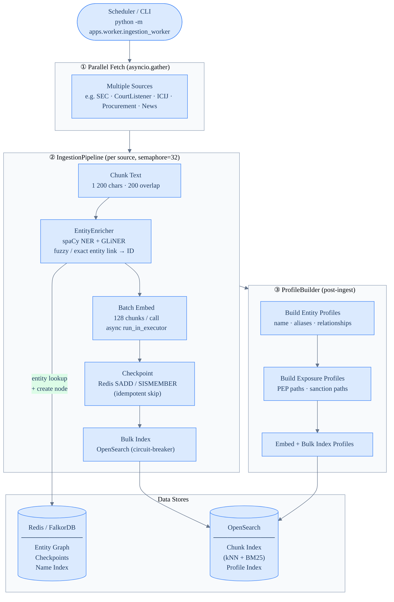
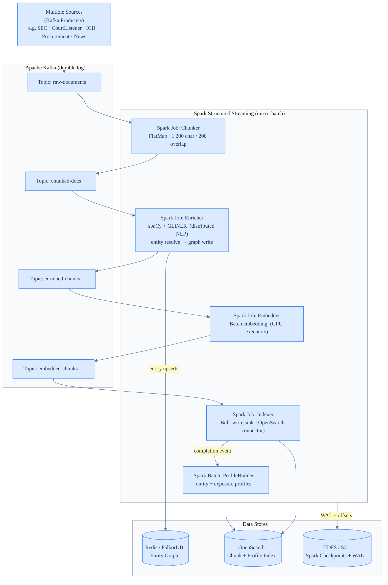
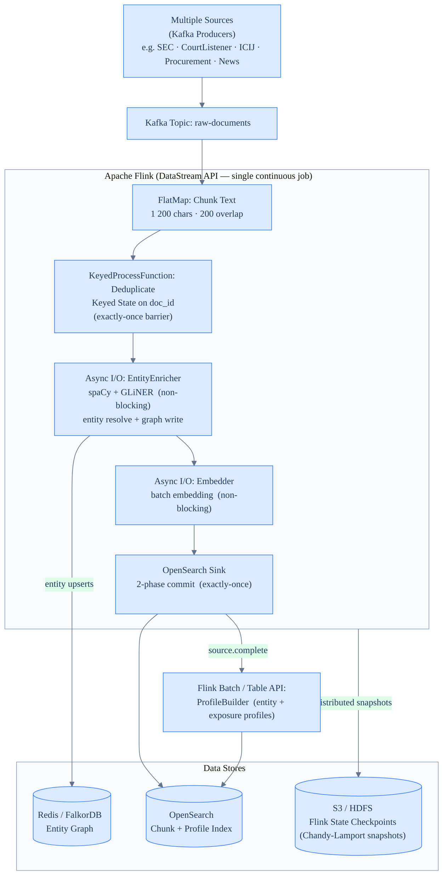
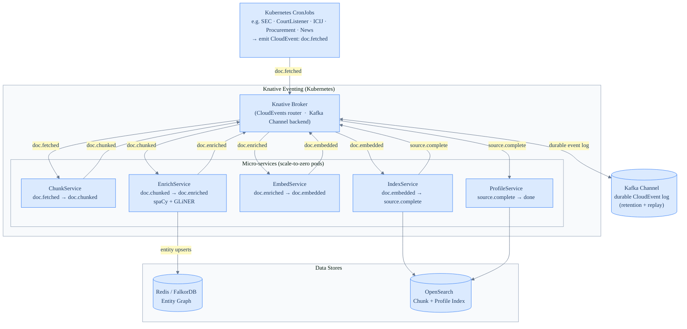
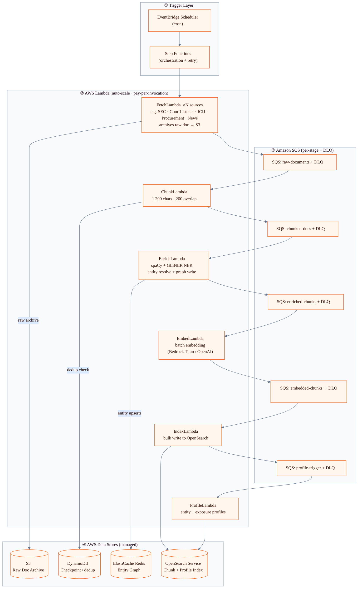

# FinAgent — Ingestion Pipeline: Architectures

**Navigation:** [README](../README.md) · [Architecture](Architecture.md) · [Agent Workflow](AgentWorkflowExplaination.md) · [Links](Links.md)

---

> **Rendering:** GitHub renders all `mermaid` blocks natively. VSCode needs `bierner.markdown-mermaid` (`Ctrl+Shift+V`).
> PNG of the current architecture: `docs/ingest_current.png`

---

## Current Architecture — Python Async Worker

A single Python process run on demand or schedule. All sources are fetched in parallel via `asyncio.gather`; each source is then processed sequentially through the pipeline with a semaphore bounding concurrency to 32.

---

## Alternative ①  —  Kafka + Spark

Each source publishes raw documents to a Kafka topic. Spark Structured Streaming consumes in micro-batches, with a separate job per stage writing results back to Kafka before the next stage picks up. Profile building runs as a Spark Batch job triggered on completion.

---

## Alternative ②  —  Kafka + Flink

A single continuous Flink DataStream job consumes raw documents from Kafka and processes them through chained operators — including keyed-state deduplication and Async I/O for non-blocking NER and embedding calls. The OpenSearch sink uses two-phase commit for exactly-once delivery. Profile building runs as a Flink Batch / Table API job.

---

## Alternative ③  —  Kafka + Knative Eventing

Each pipeline stage is a separate Kubernetes micro-service that scales to zero when idle. Kubernetes CronJobs emit `doc.fetched` CloudEvents to a Knative Broker (backed by a Kafka Channel for durability). Triggers route each event type to the appropriate service, which processes the payload and emits a new event for the next stage.

---

## Alternative ④  —  AWS Lambda + SQS

Fully serverless on AWS. EventBridge Scheduler triggers Step Functions, which fan out to per-source FetchLambdas. Each processing stage is a Lambda triggered by its upstream SQS queue. Every queue has a Dead-Letter Queue for failed messages. DynamoDB handles idempotent deduplication in place of Redis checkpoints.

---

## Architecture Comparison

| Dimension | **Current (Python Worker)** | **Kafka + Spark** | **Kafka + Flink** | **Kafka + Knative** | **AWS Lambda + SQS** |
| --- | --- | --- | --- | --- | --- |
| **Throughput** | Medium — async Python, single process | Very high — distributed, partitioned | Very high — true streaming, backpressure | High — auto-scales pods per event rate | Medium — Lambda concurrency limits apply |
| **Latency** | Batch: 20 min – 4 h per run | Micro-batch: 5 – 30 s end-to-end | Sub-second (streaming) | Seconds (pod cold-start on first event) | Seconds (Lambda cold-start on first event) |
| **Exactly-once delivery** | No — Redis dedup (at-least-once) | No — at-least-once (Kafka offsets) | Yes — Flink 2PC + Chandy-Lamport snapshots | No — CloudEvent retry (at-least-once) | No — SQS at-least-once + DLQ |
| **Fault tolerance** | Redis checkpoint; re-run to resume | Kafka offset replay + Spark WAL | Flink distributed snapshots; resume mid-stream | Knative retry + Kafka Channel durability | SQS DLQ + Step Functions retry + S3 archive |
| **Replay / reprocess** | Re-run script, Redis dedup skips seen docs | Seek Kafka offset to any point in time | Restore Flink savepoint; resume from any offset | Re-publish CloudEvents from Kafka Channel | Replay from S3 raw archive |
| **Real-time ingestion** | No — batch only | Near-real-time (micro-batch window) | Yes — continuous sub-second | Yes — event-driven on doc publish | Yes — event-driven on doc publish |
| **Horizontal scale** | No — vertical only (semaphore) | Yes — add Spark executors / partitions | Yes — add Flink task slots | Yes — Kubernetes pod autoscaler (HPA/KEDA) | Yes — Lambda concurrency scales automatically |
| **Operational complexity** | Very low — one Python script, Docker Compose | Very high — Spark cluster + Kafka + Zookeeper | High — Flink cluster + Kafka + state backend | High — Kubernetes + Knative + Kafka + Strimzi | Low — all managed services, no infra to run |
| **Infrastructure cost** | Low — single container | High — always-on Spark + Kafka cluster | High — always-on Flink + Kafka cluster | Medium — K8s base cost + scale-to-zero pods | Pay-per-use — near-zero at idle |
| **Dev / debug complexity** | Low — plain Python, easy to run locally | High — Spark + PySpark + cluster config | High — Flink API + distributed state debugging | Medium — CloudEvents contract + K8s manifests | Medium — SAM / CDK + Lambda limits (15 min, 10 GB) |
| **Vendor lock-in** | None — runs anywhere | None — open source | None — open source | Partial — Kubernetes (EKS / GKE / AKS) | High — AWS-specific (EventBridge, SQS, Lambda, Bedrock) |
| **Best fit** | Current load: small–medium batch, single-tenant, simple ops | Large-scale batch analytics on existing Spark infra | Low-latency, high-volume, exactly-once requirement | Cloud-native K8s shop wanting microservice isolation | AWS-native, minimal ops, spiky / unpredictable load |

### Decision guidance

- **Stay on current** if batch latency is acceptable and ops simplicity matters most.
- **Kafka + Flink** if you need exactly-once guarantees and sub-second latency (e.g. live sanctions feed).
- **Kafka + Spark** if you already run a Spark cluster and care about throughput over latency.
- **Kafka + Knative** if the team is already on Kubernetes and wants per-service independent scaling.
- **Lambda + SQS** if you are AWS-native, traffic is spiky, and you want zero infrastructure management.
